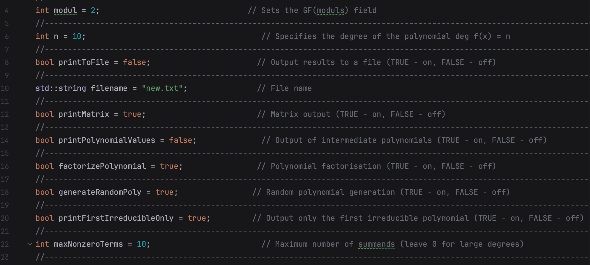
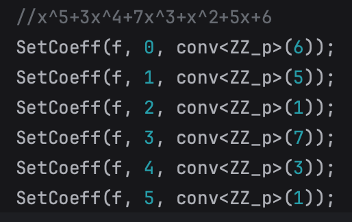
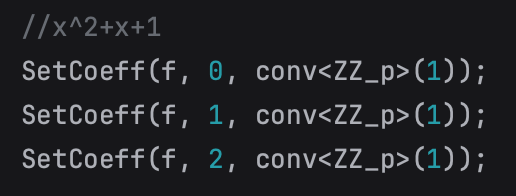
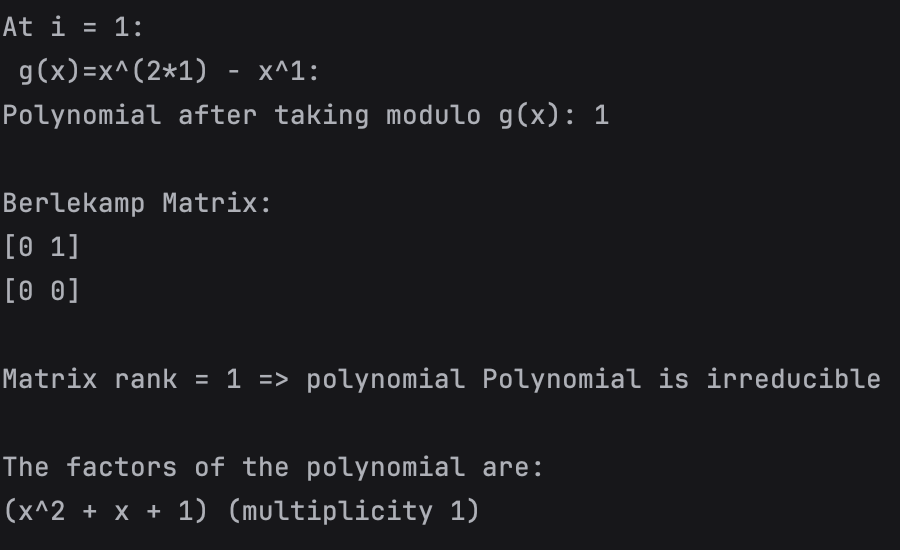
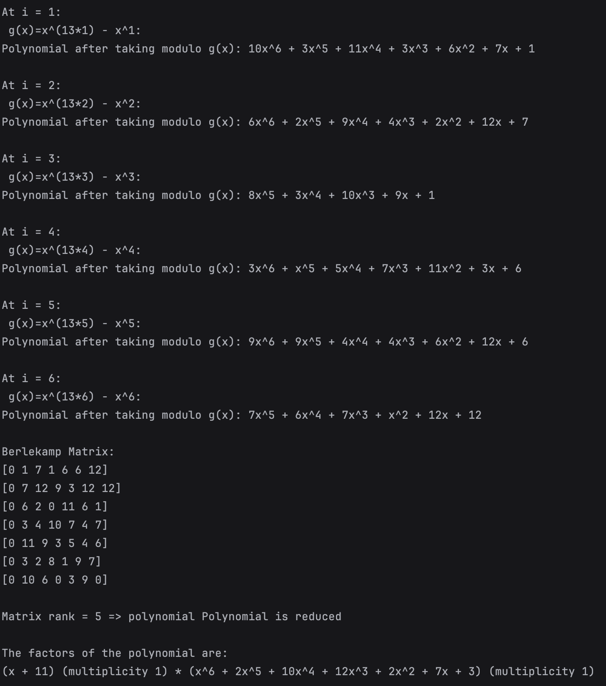
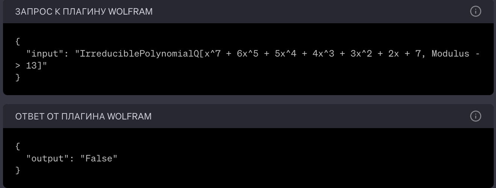

### Dependencies

- NTL
- GMP
- C++11
- I was using macOS, so launching the programme was as follows:

    g++ -std=c++11 -I/opt/homebrew/Cellar/ntl/11.5.1/include main.cpp berlecamp.cpp -o main -L/opt/homebrew/Cellar/ntl/11.5.1/lib -lntl -lgmp

# Pre-operation settings

This project is designed for convenient work with polynomials, 
in particular, to determine the reducibility of a polynomial over finite fields using the Berlekemp algorithm

Before you start working, you need to configure a few parameters 
in the main.cpp file

Then you can enter your polynomial in the same file, just below, here are examples of how to specify polynomials

# Example of work

There are two variants of the programme, you can either enter your polynomial over a finite field to find out whether it is reducible or not and get its decomposition, or generate and output the first irreducible polynomial of the required degree over a given field

You can read about the maths behind this algorithm here [link](https://johnkerl.org/doc/iw2009/berlekamp.pdf)

### Tests

Let's take a trivial example of an irreducible polynomial over the field GF(2) to check the program works, and so, the original polynomial is x^2+x+1

Programme output:

For the second test, let's take a more non-trivial example, x^7+6x^5+5x^4+4x^3+3x^2+2x^1+7 over the field GF(13)

Programme output:

Let's compare the output of the programme with the answer at wolframalpha.com

The results coincide.